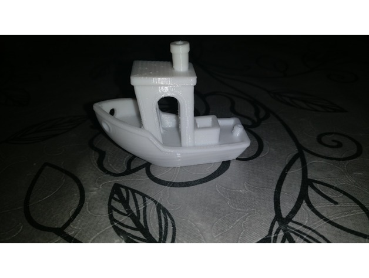
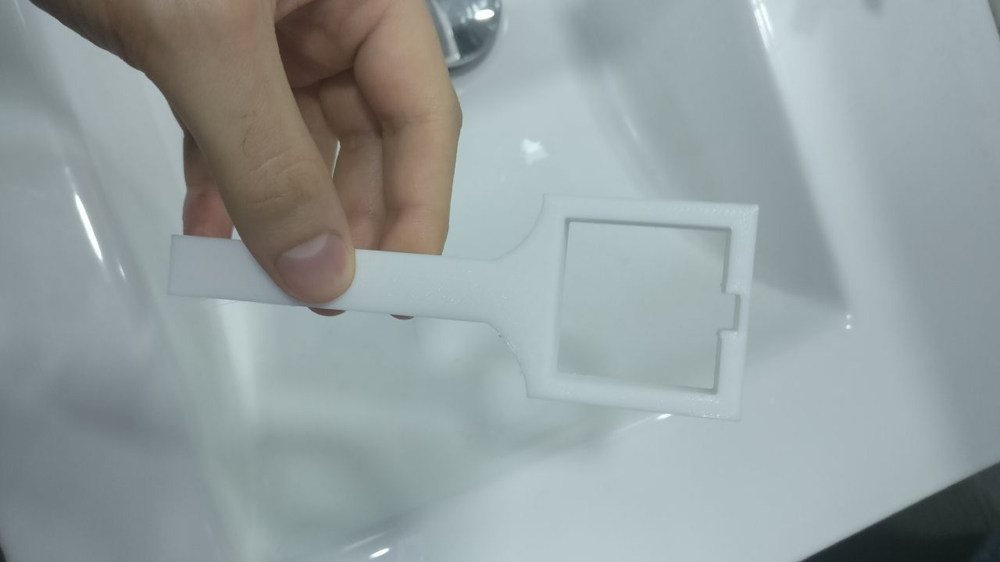
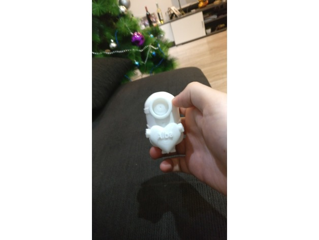
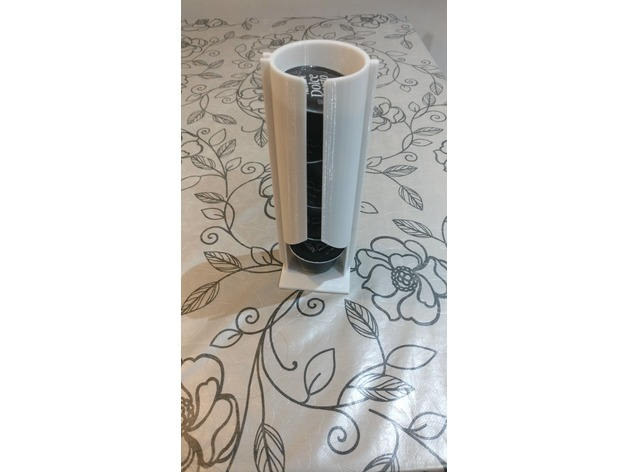
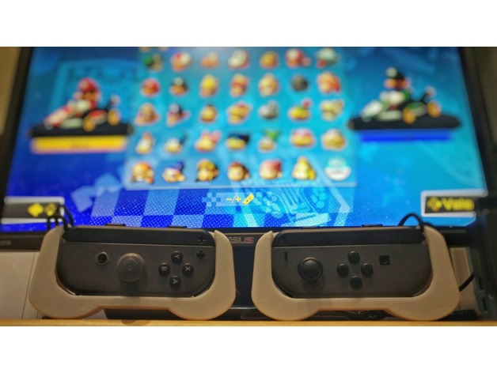

# Repository for my 3D prints

## 3D prints done:

* 3DBenchy

Tipical first 3D print to test the printer. Designed by [CreativeTools](https://www.thingiverse.com/CreativeTools/about)  
| [STL](./STL_files/3DBenchy.stl) | [GCode]() | [Thingiverse](https://www.thingiverse.com/make:430904) |    
* Ducha

Fix for the shower regulation. Designed by myself.  
| [STL](./STL_files/ducha.stl) | [GCode](./Gcodes/ducha.gcode) | 
* Minion Alba

Customised minion for my sister. Designed by [wlky](https://www.thingiverse.com/wlky/about)  
| [STL](./STL_files/minion_alba.stl) | [GCode](./Gcodes/minion_alba.gcode) | [Thingiverse](https://www.thingiverse.com/make:430903) |  
* Dolce Gusto

Holder for dolce gusto capsules.  Designed by [Mackumus](https://www.thingiverse.com/Makcumus/about).  
| [STL](./STL_files/dolce_gusto.stl) | [GCode](./Gcodes/dolce_gusto.gcode) | [Thingiverse](https://www.thingiverse.com/make:430905) | 
* JoyCon_Grip

Better Grid for the Nintendo Switch Joy Controllers.  Designed by [3DBotMaker](https://www.thingiverse.com/3DBotMaker/about).  
| [STL](./STL_files/dolce_gusto.stl) | [GCode](./Gcodes/dolce_gusto.gcode) | [Thingiverse](https://www.thingiverse.com/make:430964) | [Instagram](https://www.instagram.com/p/Bd492I6Ae7p/) |